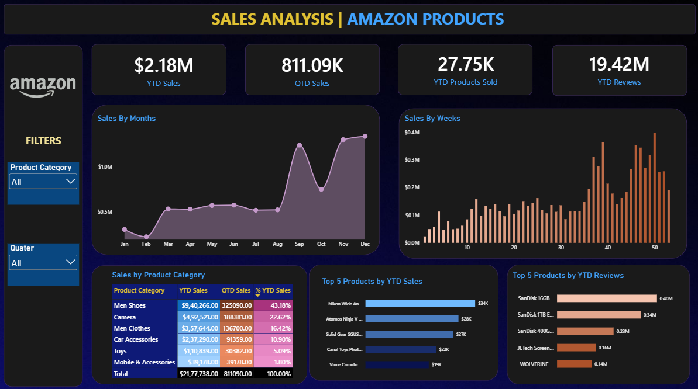

# 📊 Amazon Sales Analysis Dashboard | Power BI

An interactive Amazon Sales Analysis dashboard developed using Microsoft Power BI to analyze sales performance, product categories, sales trends, top-performing products, and customer engagement.



---

## 📌 Project Overview

This project analyzes Amazon product sales data covering the period from **January 2019 to December 2022**.

The dashboard focuses on **2022 sales performance** and provides an interactive view of key business performance indicators, sales trends, product categories, top-performing products, and customer review activity.

The project was developed as a practical Power BI learning project to strengthen skills in **data visualization, DAX, Power Query, KPI development, and business-oriented analytics**.

---

## 🎯 Business Objective

The objective of this project is to provide a centralized dashboard for monitoring Amazon sales performance and identifying important trends and product-level opportunities.

The dashboard helps answer key business questions such as:

- How are sales performing throughout the year?
- Which product categories generate the highest sales?
- Which products are the top revenue contributors?
- Which products receive the highest number of reviews?
- How does quarterly sales performance change throughout the year?
- Which months and weeks show significant sales fluctuations?

---

## 📊 Key Performance Indicators

| KPI | 2022 Value |
|---|---:|
| YTD Sales | **$2.18M** |
| QTD Sales | **$811.09K** |
| YTD Products Sold | **27.75K** |
| YTD Reviews | **19.42M** |

### KPI Purpose

- **YTD Sales:** Measures year-to-date revenue performance.
- **QTD Sales:** Measures sales generated during the selected quarter.
- **YTD Products Sold:** Indicates the number of product records/orders represented during the year.
- **YTD Reviews:** Indicates customer engagement through product reviews.

---

## 📈 Dashboard Components

### Sales Trend Analysis

**YTD Sales by Month**

A line chart is used to visualize monthly sales trends and identify seasonal patterns and changes in performance.

**YTD Sales by Week**

A column chart is used to analyze weekly sales performance and identify short-term fluctuations.

### Product Category Analysis

The category analysis provides:

- YTD Sales
- QTD Sales
- Percentage of YTD Sales

This allows comparison of sales contribution across product categories.

### Product Performance

**Top 5 Products by YTD Sales**

Identifies the leading products based on year-to-date sales.

**Top 5 Products by YTD Reviews**

Highlights products with the highest number of reviews and provides an indication of customer engagement.

### Interactive Filters

The dashboard provides interactive filters for:

- Product Category
- Quarter

---

## 🔍 Key Insights

### Overall Performance

- 2022 generated approximately **$2.18M in sales**.
- Approximately **27.75K product records** were recorded during 2022.
- Product reviews reached approximately **19.42M**.
- **Q4 generated $811.09K**, making it the strongest quarter of 2022.

### Quarterly Performance

| Quarter | Sales |
|---|---:|
| Q1 | $347.01K |
| Q2 | $448.34K |
| Q3 | $571.30K |
| Q4 | $811.09K |

Sales increased progressively across the four quarters, with Q4 showing the strongest performance.

### Category Performance

| Product Category | YTD Sales | % of YTD Sales |
|---|---:|---:|
| Men Shoes | $940.27K | 43.18% |
| Camera | $492.52K | 22.62% |
| Men Clothes | $357.64K | 16.42% |
| Car Accessories | $237.29K | 10.90% |
| Toys | $110.84K | 5.09% |
| Mobile & Accessories | $39.18K | 1.80% |

**Men Shoes** was the largest contributor to 2022 YTD sales, accounting for approximately **43.18%** of total sales.

Men Shoes and Camera together contributed approximately **65.80%** of total YTD sales.

---

## 💡 Business Recommendations

Based on the analysis:

1. **Inventory Planning**  
   Prioritize inventory planning for high-performing categories, particularly Men Shoes and Camera.

2. **Seasonal Planning**  
   The strong Q4 performance suggests the importance of preparing inventory and promotional strategies for higher year-end demand.

3. **Product-Level Analysis**  
   Investigate the characteristics of top-selling products to identify patterns that may support future product and merchandising decisions.

4. **Customer Engagement**  
   Use review activity alongside sales performance to identify products with strong customer interest.

5. **Category Optimization**  
   Investigate lower-performing categories to identify opportunities related to pricing, marketing, product selection, and customer demand.

---

## 🗂️ Dataset

The dataset contains **89,082 records** covering:

**January 2019 – December 2022**

### Dataset Fields

- Product Category
- Product Description
- Price (Dollar)
- Number of Reviews
- Shipment
- Order Date

The detailed data dictionary is available in:

[`Documentation/Data_Dictionary.md`](Documentation/Data_Dictionary.md)

---

## 🧹 Data Preparation

The dataset was prepared for analysis using Power BI and Power Query.

The analysis uses the `Order Date` field to support time-based analysis including:

- Year
- Quarter
- Month
- Week

These fields enable monthly, weekly, quarterly, and year-to-date analysis.

---

## 🛠️ Tools & Technologies

| Tool | Purpose |
|---|---|
| **Microsoft Power BI** | Dashboard development and visualization |
| **Power Query** | Data preparation and transformation |
| **DAX** | KPI and analytical calculations |
| **Microsoft Excel** | Dataset source |
| **GitHub** | Project documentation and version control |

---

## 📁 Repository Structure

```text
amazon-sales-analysis-powerbi/
│
├── Dashboard/
│   ├── Amazon_Sales_Analysis.pbix
│   └── Amazon_Sales_Dashboard.png
│
├── Dataset/
│   ├── Amazon_Combined_Data.xlsx
│   └── README.md
│
├── Documentation/
│   ├── Problem_Statement.md
│   ├── KPI_Definitions.md
│   ├── Dashboard_Requirements.md
│   ├── Data_Dictionary.md
│   └── Key_Insights.md
│
└── README.md
